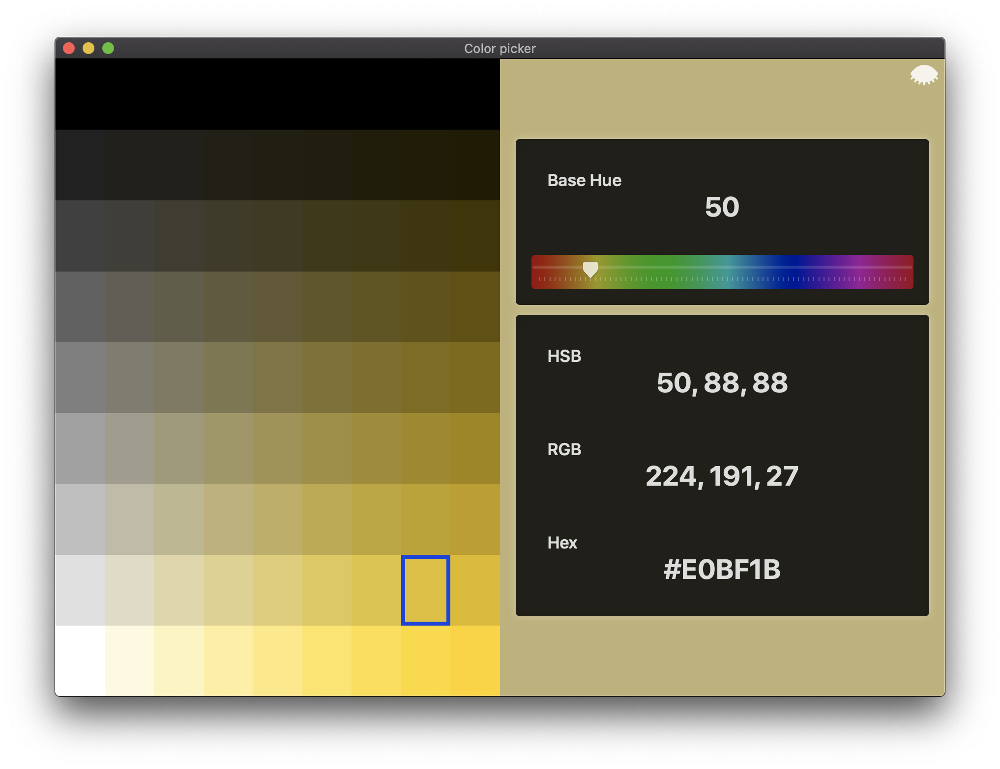

# mantia-color-picker

SwiftUI macOS color picker inspired by Louie Mantia's color palette.

<blockquote class="twitter-tweet">
&quot;This isn&#39;t a Louie Mantia color.&quot;  (That means it isn&#39;t 5° increment for Hue or ⅛ of 100% increment for Saturation and Brightness.)
&mdash; Louie (@Mantia) <a href="https://twitter.com/Mantia/status/570687359328645120?ref_src=twsrc%5Etfw">February 25, 2015</a></blockquote>

## Features

- Hue slider with 5° increments.
- Color grid with ⅛ of 100% increment for Saturation and Brightness.
- Preview selected color in the background of the window.
- Display HRB, RGB and Hex values.
- Pasteboard integration.

## SwiftUI

This is just a fun side project to play with SwiftUI. It's a single screen application so there is not much going on but is interesting to play with nonetheless. You won't find ViewModels or any fancy architecture, and this is a conscious decisions. Is nice to keep things simple for once 😂 

## Watch

You can watch the development of this app on my [Youtube channel](https://www.youtube.com/channel/UCfiBFlVY8s-tmJGDMNCd26w/featured?view_as=subscriber).

1. [Building a color picker macOS App PART 1](https://www.youtube.com/watch?v=YKvy_G05sOM)
2. [Building a color picker macOS App PART 2](https://www.youtube.com/watch?v=7u-yKYDXcGU)

Watch live at [https://www.twitch.tv/alejandromp4](https://www.twitch.tv/alejandromp4)

## Contributions & support

This project is developed completely in the open, and your contributions are more than welcome.

This project does not come with GitHub Issues-based support, and users are instead encouraged to become active participants in its continued development — by fixing any bugs that they encounter, or improving the documentation wherever it’s found to be lacking.

If you wish to make a change, [open a Pull Request](https://github.com/alexito4/EquallySpacedStack/pull/new) — even if it just contains a draft of the changes you’re planning, or a test that reproduces an issue — and we can discuss it further from there.

## License

This is just a side project of mine and is not a production ready application. I've open source it so it can help people learn a little bit. Refrain from stealing this source and selling it as your own.

## Author

Alejandro Martinez | https://alejandromp.com | [@alexito4](https://twitter.com/alexito4)